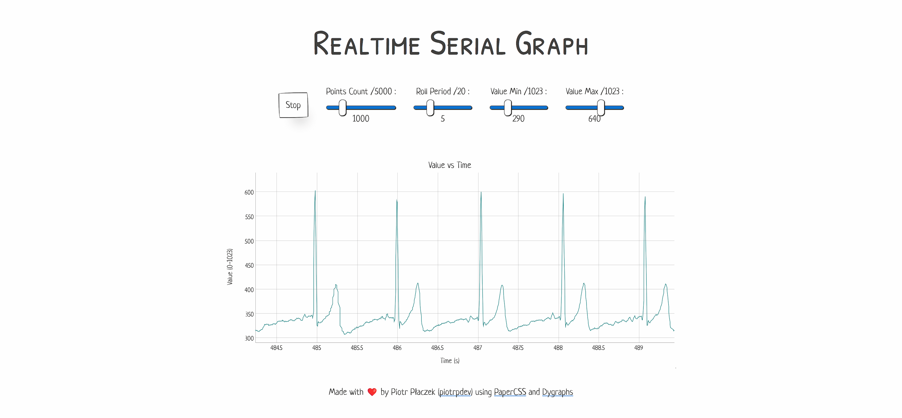

# Realtime Serial Graph



Website that reads realtime data from a device (e.g. Arduino) using the [Web Serial API](https://developer.mozilla.org/en-US/docs/Web/API/Web_Serial_API)
and displays it nicely using [Dygraphs](https://github.com/danvk/dygraphs) and [PaperCSS](https://github.com/papercss/papercss).

## Serial Data Format

The TypeScript code uses a custom [`Transformer`](https://developer.mozilla.org/en-US/docs/Web/API/TransformStream/TransformStream#transformer) that extracts an [integer](https://developer.mozilla.org/en-US/docs/Web/JavaScript/Reference/Global_Objects/Number/parseInt) inside two chevrons (`"<"`, `">"`). If you don't want to make your own custom `Transformer` just send your serial data like this:

```cpp
Serial.print("<" + String(analogRead(A0)) + ">");
```

An example Arduino sketch is provided in [`./Heart_Rate_Display_Arduino/`](./Heart_Rate_Display_Arduino/), here is the source:

```txt
Heart_Rate_Display.ino
Demo Program for AD8232 Heart Rate sensor.
Casey Kuhns @ SparkFun Electronics
6/27/2014
https://github.com/sparkfun/AD8232_Heart_Rate_Monitor
```
